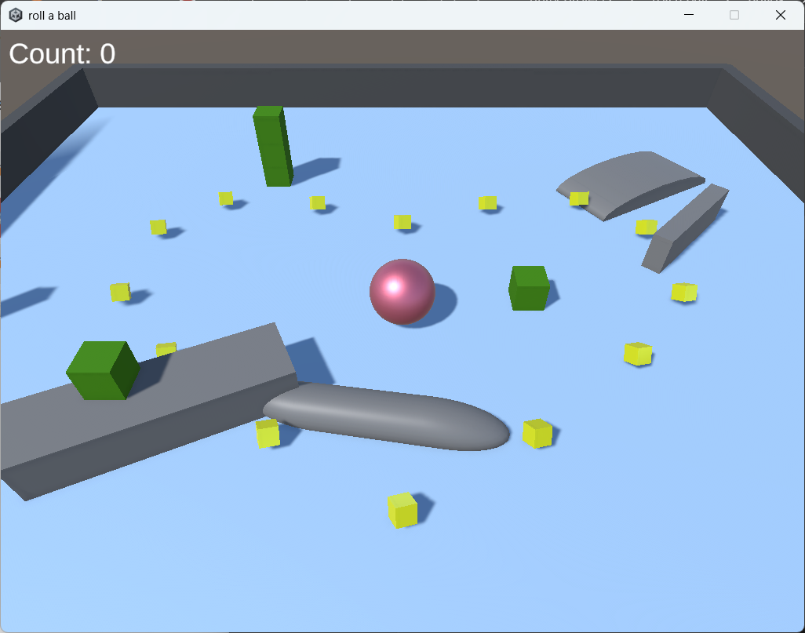
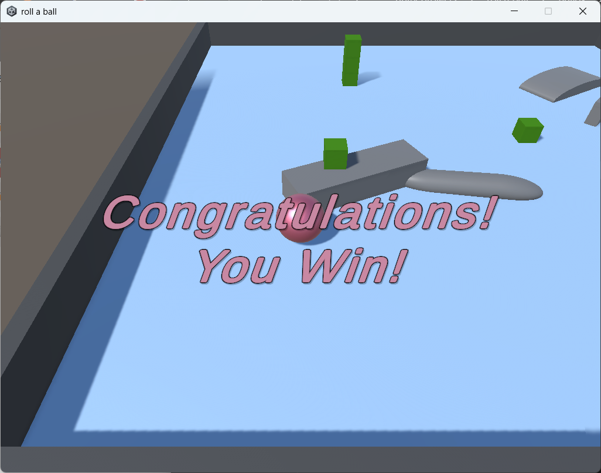
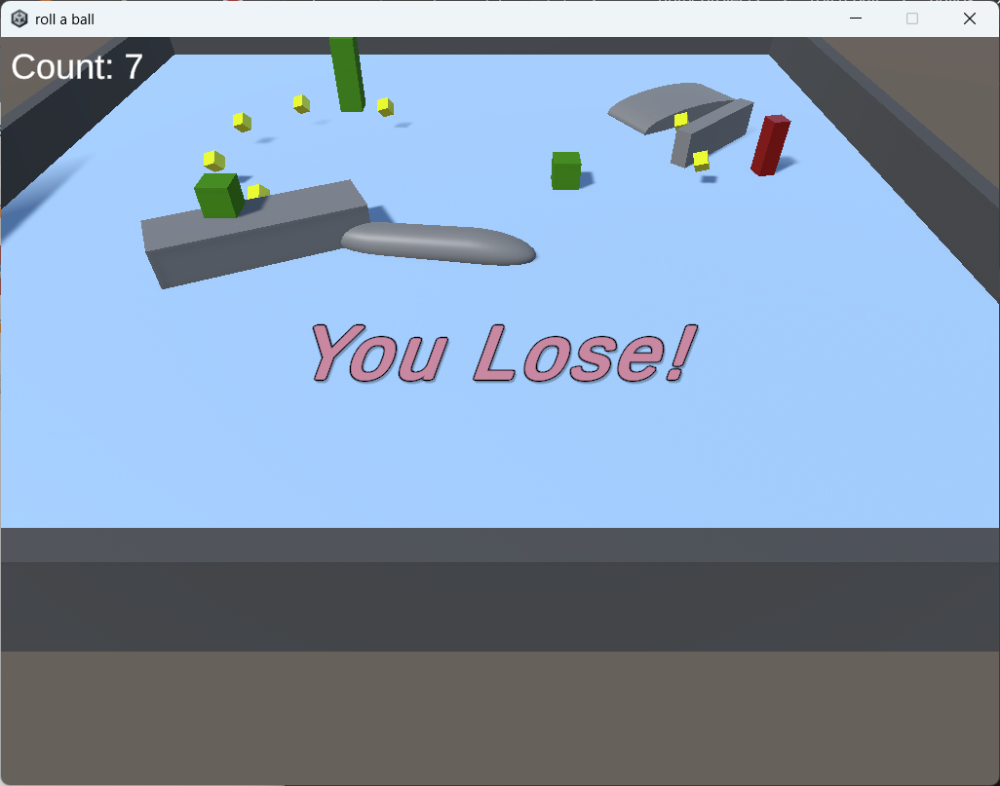

# Roll-a-Ball (Unity Project)

This project was created by following Unity's official **Roll-a-Ball** tutorial.

In addition to the tutorial features, a custom improvement was implemented:

**Floating Collectibles**  
All collectible objects have a floating animation to make them more dynamic and visually engaging.

---

## Features

- Player movement using physics
- Collectible objects
- Score counter system
- Win condition
- Lose condition
- Floating animation added to collectibles (custom feature)

---

## Built With

- Unity
- C#
- Unity Physics System

---

## How to Run

1. Clone the repository:
git clone https://github.com/aybukeKrcvs/unity-roll-a-ball.git
2. Open Unity Hub
3. Add project from disk
4. Select the project folder
5. Open the main scene and press **Play**

---
## 📷 Screenshots

---

## Source

Based on Unity Learn tutorial:    
https://learn.unity.com/project/roll-a-ball  
https://www.youtube.com/watch?v=nnDFXmoNBOo  

---

## Author

Created as a learning project while practicing Unity fundamentals.
